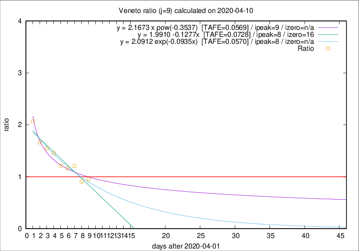

# Veneto

Data source: https://raw.githubusercontent.com/pcm-dpc/COVID-19/master/dati-json/dpc-covid19-ita-regioni.json

Delta days analysis (j): 9

Analyses for other values of j for 2020-04-10 are avalable [here](../README.md)

Analyses for Veneto for previous dates are avalable [here](../../README.md)

## Fitting 
|fit type|best fit equation|tafe|tfe|ipeak|izero|
|-------|-----|--------|------|---|---|
|linear|y = 1.9910 -0.1277x  [TAFE=0.0728]|0.0728|0.0034|8|16|
|exp|y = 2.0912 exp(-0.0935x)  [TAFE=0.0570]|0.0570|0.0020|8|n/a|
|pow|y = 2.1673 x pow(-0.3537)  [TAFE=0.0569]|0.0569|0.0025|9|n/a|

## Data
|Date|Daily deaths|Cumulated deaths|Deaths in the last 9 days|Deaths in the 9 days before|ratio|
|----|----------|-----------|-------|--------------------|-----|
|2020-04-10|37|793|294|307|0.9577|
|2020-04-09|20|756|279|308|0.9058|
|2020-04-08|41|736|323|267|1.2097|
|2020-04-07|33|695|303|261|1.1609|
|2020-04-06|31|662|300|247|1.2146|
|2020-04-05|24|631|318|219|1.4521|
|2020-04-04|35|607|320|207|1.5459|
|2020-04-03|40|572|314|189|1.6614|
|2020-04-02|33|532|316|153|2.0654|

[Download data as CSV](COVID-19_veneto_j9_2020-04-10.csv)

Generated April 10th, 2020 at 17:26:10 UTC+0200 with https://github.com/robianc/COVID-19
