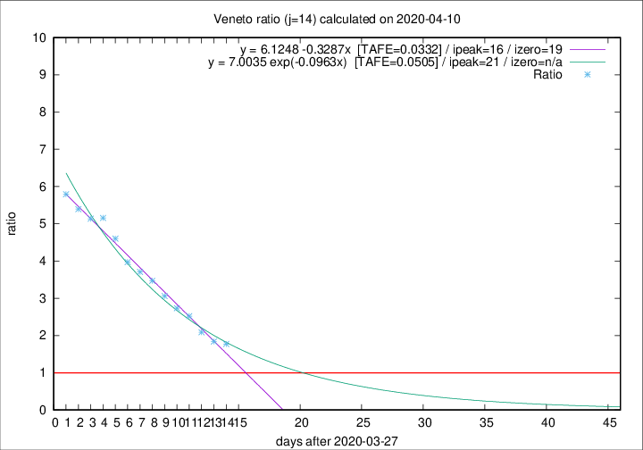

# Veneto

Data source: https://raw.githubusercontent.com/pcm-dpc/COVID-19/master/dati-json/dpc-covid19-ita-regioni.json

Estimates in this page were made on 14/4/2020 with data available until 10/04/2020.

## Summary 

### Peak estimate 
|j|linear [TAFE]|exponential [TAFE]|power law [TAFE]|details|
|---|----|-----------|---------|-------|
|7|8/4/2020 [TAFE=0.0497]|8/4/2020 [TAFE=0.0488]|7/4/2020 [TAFE=0.0584]|[analysis](COVID-19_veneto_j7_2020-04-10.md)|
|8|10/4/2020 [TAFE=0.0727]|10/4/2020 [TAFE=0.0665]|9/4/2020 [TAFE=0.0610]|[analysis](COVID-19_veneto_j8_2020-04-10.md)|
|9|10/4/2020 [TAFE=0.0728]|10/4/2020 [TAFE=0.0570]|11/4/2020 [TAFE=0.0569]|[analysis](COVID-19_veneto_j9_2020-04-10.md)|
|10|11/4/2020 [TAFE=0.0602]|11/4/2020 [TAFE=0.0439]|16/4/2020 [TAFE=0.0866]|[analysis](COVID-19_veneto_j10_2020-04-10.md)|
|11|12/4/2020 [TAFE=0.0551]|13/4/2020 [TAFE=0.0361]|23/4/2020 [TAFE=0.0930]|[analysis](COVID-19_veneto_j11_2020-04-10.md)|
|12|12/4/2020 [TAFE=0.0373]|14/4/2020 [TAFE=0.0370]|2/5/2020 [TAFE=0.1191]|[analysis](COVID-19_veneto_j12_2020-04-10.md)|
|13|12/4/2020 [TAFE=0.0488]|16/4/2020 [TAFE=0.0437]|17/5/2020 [TAFE=0.1452]|[analysis](COVID-19_veneto_j13_2020-04-10.md)|
|14|13/4/2020 [TAFE=0.0332]|18/4/2020 [TAFE=0.0505]|19/6/2020 [TAFE=0.1572]|[analysis](COVID-19_veneto_j14_2020-04-10.md)|

Best estimator is linear with j=14 (TAFE=0.0332)
Corresponding peak date estimate is 13/4/2020 (ipeak 16)

Peak date range estimate: 31/3/2020 - 19/6/2020

### End estimate 
|j|linear [TAFE/TFE]|exponential [TAFE/TFE]|power law [TAFE/TFE]|details|
|---|----|-----------|---------|-------|
|7|30/4/2020 [TAFE=0.0497]|-|-|[analysis](COVID-19_veneto_j7_2020-04-10.md)|
|8|-|-|-|[analysis](COVID-19_veneto_j8_2020-04-10.md)|
|9|-|-|-|[analysis](COVID-19_veneto_j9_2020-04-10.md)|
|10|-|-|-|[analysis](COVID-19_veneto_j10_2020-04-10.md)|
|11|-|-|-|[analysis](COVID-19_veneto_j11_2020-04-10.md)|
|12|16/4/2020 [TAFE=0.0373]|-|-|[analysis](COVID-19_veneto_j12_2020-04-10.md)|
|13|-|-|-|[analysis](COVID-19_veneto_j13_2020-04-10.md)|
|14|16/4/2020 [TAFE=0.0332]|-|-|[analysis](COVID-19_veneto_j14_2020-04-10.md)|

Best estimator is linear with j=14 (TAFE=0.0332)
Corresponding end date estimate is 16/4/2020 (izero 19)

End date range estimate: 28/3/2020 - 23/4/2020

Generated April 14th, 2020 at 19:16:04 UTC+0200 with https://github.com/robianc/COVID-19
