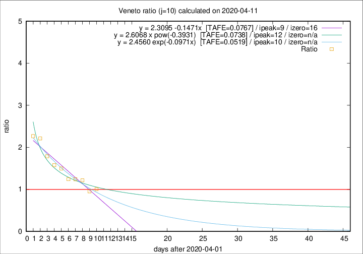

# Veneto

Data source: https://raw.githubusercontent.com/pcm-dpc/COVID-19/master/dati-json/dpc-covid19-ita-regioni.json

Delta days analysis (j): 10

Analyses for other values of j for 2020-04-11 are avalable [here](../2020-04-11/README.md)

Analyses for Veneto for previous dates are avalable [here](../README.md)

## Fitting 
|fit type|best fit equation|tafe|tfe|ipeak|izero|
|-------|-----|--------|------|---|---|
|linear|y = 2.3095 -0.1471x  [TAFE=0.0767]|0.0767|0.0027|9|16|
|exp|y = 2.4560 exp(-0.0971x)  [TAFE=0.0519]|0.0519|0.0021|10|n/a|
|pow|y = 2.6068 x pow(-0.3931)  [TAFE=0.0738]|0.0738|0.0036|12|n/a|

## Data
|Date|Daily deaths|Cumulated deaths|Deaths in the last 10 days|Deaths in the 10 days before|ratio|
|----|----------|-----------|-------|--------------------|-----|
|2020-04-11|38|831|332|330|1.0061|
|2020-04-10|37|793|316|331|0.9547|
|2020-04-09|20|756|343|282|1.2163|
|2020-04-08|41|736|344|277|1.2419|
|2020-04-07|33|695|333|268|1.2425|
|2020-04-06|31|662|349|233|1.4979|
|2020-04-05|24|631|344|218|1.5780|
|2020-04-04|35|607|349|195|1.7897|
|2020-04-03|40|572|356|161|2.2112|
|2020-04-02|33|532|340|150|2.2667|

[Download data as CSV](COVID-19_veneto_j10_2020-04-11.csv)

Generated April 14th, 2020 at 19:16:04 UTC+0200 with https://github.com/robianc/COVID-19
