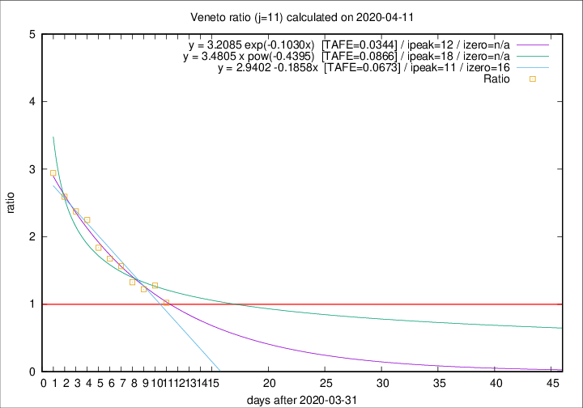

# Veneto

Data source: https://raw.githubusercontent.com/pcm-dpc/COVID-19/master/dati-json/dpc-covid19-ita-regioni.json

Delta days analysis (j): 11

Analyses for other values of j for 2020-04-11 are avalable [here](../2020-04-11/README.md)

Analyses for Veneto for previous dates are avalable [here](../README.md)

## Fitting 
|fit type|best fit equation|tafe|tfe|ipeak|izero|
|-------|-----|--------|------|---|---|
|linear|y = 2.9402 -0.1858x  [TAFE=0.0673]|0.0673|-0.0001|11|16|
|exp|y = 3.2085 exp(-0.1030x)  [TAFE=0.0344]|0.0344|0.0010|12|n/a|
|pow|y = 3.4805 x pow(-0.4395)  [TAFE=0.0866]|0.0866|0.0054|18|n/a|

## Data
|Date|Daily deaths|Cumulated deaths|Deaths in the last 11 days|Deaths in the 11 days before|ratio|
|----|----------|-----------|-------|--------------------|-----|
|2020-04-11|38|831|354|346|1.0231|
|2020-04-10|37|793|380|298|1.2752|
|2020-04-09|20|756|364|298|1.2215|
|2020-04-08|41|736|374|282|1.3262|
|2020-04-07|33|695|382|244|1.5656|
|2020-04-06|31|662|375|224|1.6741|
|2020-04-05|24|631|373|203|1.8374|
|2020-04-04|35|607|391|174|2.2471|
|2020-04-03|40|572|380|160|2.3750|
|2020-04-02|33|532|363|140|2.5929|
|2020-04-01|22|499|353|120|2.9417|

[Download data as CSV](COVID-19_veneto_j11_2020-04-11.csv)

Generated April 12th, 2020 at 17:02:01 UTC+0200 with https://github.com/robianc/COVID-19
