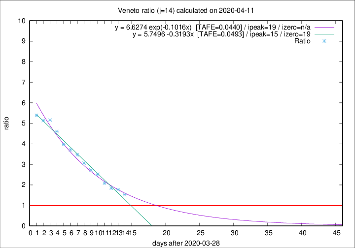

# Veneto

Data source: https://raw.githubusercontent.com/pcm-dpc/COVID-19/master/dati-json/dpc-covid19-ita-regioni.json

Delta days analysis (j): 14

Analyses for other values of j for 2020-04-11 are avalable [here](../README.md)

Analyses for Veneto for previous dates are avalable [here](../../README.md)

## Fitting 
|fit type|best fit equation|tafe|tfe|ipeak|izero|
|-------|-----|--------|------|---|---|
|linear|y = 5.7496 -0.3193x  [TAFE=0.0493]|0.0493|-0.0026|15|19|
|exp|y = 6.6274 exp(-0.1016x)  [TAFE=0.0440]|0.0440|0.0013|19|n/a|

## Data
|Date|Daily deaths|Cumulated deaths|Deaths in the last 14 days|Deaths in the 14 days before|ratio|
|----|----------|-----------|-------|--------------------|-----|
|2020-04-11|38|831|469|307|1.5277|
|2020-04-10|37|793|480|271|1.7712|
|2020-04-09|20|756|469|255|1.8392|
|2020-04-08|41|736|478|229|2.0873|
|2020-04-07|33|695|479|190|2.5211|
|2020-04-06|31|662|470|172|2.7326|
|2020-04-05|24|631|462|151|3.0596|
|2020-04-04|35|607|461|133|3.4662|
|2020-04-03|40|572|441|119|3.7059|
|2020-04-02|33|532|417|105|3.9714|
|2020-04-01|22|499|405|88|4.6023|
|2020-03-31|64|477|397|77|5.1558|
|2020-03-30|21|413|344|67|5.1343|
|2020-03-29|30|392|329|61|5.3934|

[Download data as CSV](COVID-19_veneto_j14_2020-04-11.csv)

Generated April 12th, 2020 at 16:28:18 UTC+0200 with https://github.com/robianc/COVID-19
