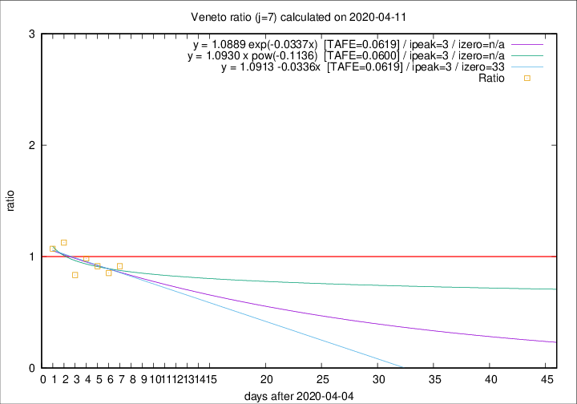

# Veneto

Data source: https://raw.githubusercontent.com/pcm-dpc/COVID-19/master/dati-json/dpc-covid19-ita-regioni.json

Delta days analysis (j): 7

Analyses for other values of j for 2020-04-11 are avalable [here](../2020-04-11/README.md)

Analyses for Veneto for previous dates are avalable [here](../README.md)

## Fitting 
|fit type|best fit equation|tafe|tfe|ipeak|izero|
|-------|-----|--------|------|---|---|
|linear|y = 1.0913 -0.0336x  [TAFE=0.0619]|0.0619|0.0062|3|33|
|exp|y = 1.0889 exp(-0.0337x)  [TAFE=0.0619]|0.0619|0.0030|3|n/a|
|pow|y = 1.0930 x pow(-0.1136)  [TAFE=0.0600]|0.0600|0.0029|3|n/a|

## Data
|Date|Daily deaths|Cumulated deaths|Deaths in the last 7 days|Deaths in the 7 days before|ratio|
|----|----------|-----------|-------|--------------------|-----|
|2020-04-11|38|831|224|245|0.9143|
|2020-04-10|37|793|221|259|0.8533|
|2020-04-09|20|756|224|245|0.9143|
|2020-04-08|41|736|237|241|0.9834|
|2020-04-07|33|695|218|261|0.8352|
|2020-04-06|31|662|249|221|1.1267|
|2020-04-05|24|631|239|223|1.0717|

[Download data as CSV](COVID-19_veneto_j7_2020-04-11.csv)

Generated April 14th, 2020 at 19:16:04 UTC+0200 with https://github.com/robianc/COVID-19
