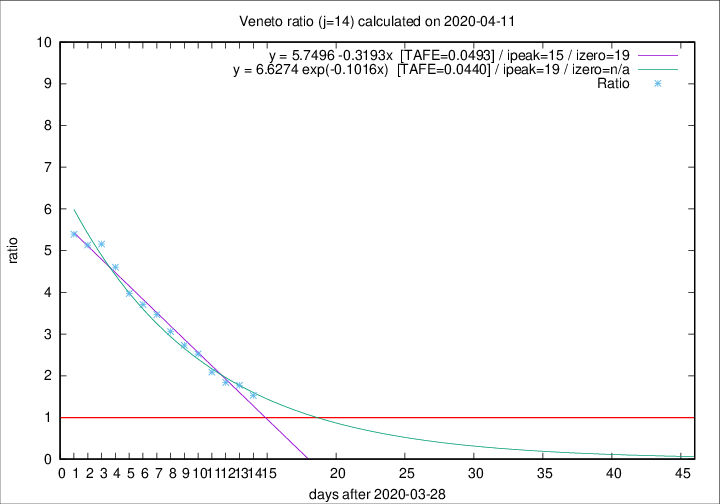

# Veneto

Data source: https://raw.githubusercontent.com/pcm-dpc/COVID-19/master/dati-json/dpc-covid19-ita-regioni.json

Estimates in this page were made on 19/4/2020 with data available until 11/04/2020.

## Summary 

### Peak estimate 
|j|linear [TAFE]|exponential [TAFE]|power law [TAFE]|details|
|---|----|-----------|---------|-------|
|7|8/4/2020 [TAFE=0.0619]|8/4/2020 [TAFE=0.0619]|8/4/2020 [TAFE=0.0600]|[analysis](COVID-19_veneto_j7_2020-04-11.md)|
|8|10/4/2020 [TAFE=0.0818]|10/4/2020 [TAFE=0.0741]|9/4/2020 [TAFE=0.0491]|[analysis](COVID-19_veneto_j8_2020-04-11.md)|
|9|11/4/2020 [TAFE=0.0614]|11/4/2020 [TAFE=0.0514]|11/4/2020 [TAFE=0.0604]|[analysis](COVID-19_veneto_j9_2020-04-11.md)|
|10|11/4/2020 [TAFE=0.0767]|12/4/2020 [TAFE=0.0519]|14/4/2020 [TAFE=0.0738]|[analysis](COVID-19_veneto_j10_2020-04-11.md)|
|11|12/4/2020 [TAFE=0.0673]|13/4/2020 [TAFE=0.0344]|19/4/2020 [TAFE=0.0866]|[analysis](COVID-19_veneto_j11_2020-04-11.md)|
|12|13/4/2020 [TAFE=0.0569]|14/4/2020 [TAFE=0.0430]|28/4/2020 [TAFE=0.1082]|[analysis](COVID-19_veneto_j12_2020-04-11.md)|
|13|13/4/2020 [TAFE=0.0614]|15/4/2020 [TAFE=0.0393]|7/5/2020 [TAFE=0.1360]|[analysis](COVID-19_veneto_j13_2020-04-11.md)|
|14|13/4/2020 [TAFE=0.0493]|17/4/2020 [TAFE=0.0440]|27/5/2020 [TAFE=0.1649]|[analysis](COVID-19_veneto_j14_2020-04-11.md)|

Best estimator is exp with j=11 (TAFE=0.0344)
Corresponding peak date estimate is 13/4/2020 (ipeak 12)

Peak date range estimate: 4/4/2020 - 30/5/2020

### End estimate 
|j|linear [TAFE/TFE]|exponential [TAFE/TFE]|power law [TAFE/TFE]|details|
|---|----|-----------|---------|-------|
|7|8/5/2020 [TAFE=0.0619]|-|-|[analysis](COVID-19_veneto_j7_2020-04-11.md)|
|8|-|-|-|[analysis](COVID-19_veneto_j8_2020-04-11.md)|
|9|21/4/2020 [TAFE=0.0614]|-|-|[analysis](COVID-19_veneto_j9_2020-04-11.md)|
|10|-|-|-|[analysis](COVID-19_veneto_j10_2020-04-11.md)|
|11|-|-|-|[analysis](COVID-19_veneto_j11_2020-04-11.md)|
|12|17/4/2020 [TAFE=0.0569]|-|-|[analysis](COVID-19_veneto_j12_2020-04-11.md)|
|13|-|-|-|[analysis](COVID-19_veneto_j13_2020-04-11.md)|
|14|17/4/2020 [TAFE=0.0493]|-|-|[analysis](COVID-19_veneto_j14_2020-04-11.md)|

Best estimator is linear with j=14 (TAFE=0.0493)
Corresponding end date estimate is 17/4/2020 (izero 19)

End date range estimate: 29/3/2020 - 1/5/2020

Generated April 19th, 2020 at 18:42:39 UTC+0200 with https://github.com/robianc/COVID-19
