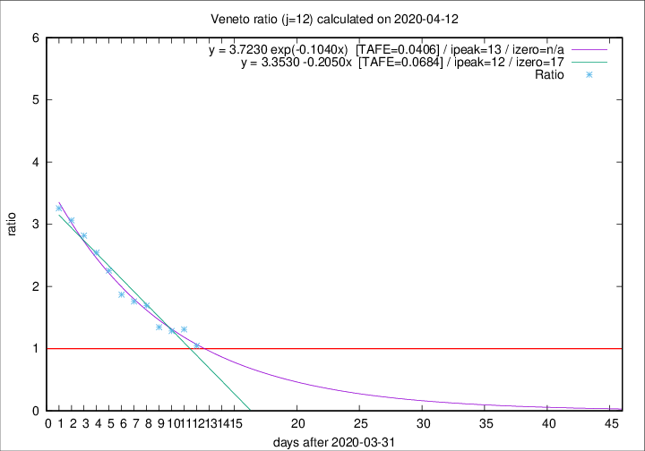

# Veneto

Data source: https://raw.githubusercontent.com/pcm-dpc/COVID-19/master/dati-json/dpc-covid19-ita-regioni.json

Delta days analysis (j): 12

Analyses for other values of j for 2020-04-12 are avalable [here](../2020-04-12/README.md)

Analyses for Veneto for previous dates are avalable [here](../README.md)

## Fitting 
|fit type|best fit equation|tafe|tfe|ipeak|izero|
|-------|-----|--------|------|---|---|
|linear|y = 3.3530 -0.2050x  [TAFE=0.0684]|0.0684|-0.0008|12|17|
|exp|y = 3.7230 exp(-0.1040x)  [TAFE=0.0406]|0.0406|0.0010|13|n/a|

## Data
|Date|Daily deaths|Cumulated deaths|Deaths in the last 12 days|Deaths in the 12 days before|ratio|
|----|----------|-----------|-------|--------------------|-----|
|2020-04-12|25|856|379|362|1.0470|
|2020-04-11|38|831|418|319|1.3103|
|2020-04-10|37|793|401|312|1.2853|
|2020-04-09|20|756|394|293|1.3447|
|2020-04-08|41|736|423|250|1.6920|
|2020-04-07|33|695|408|232|1.7586|
|2020-04-06|31|662|404|216|1.8704|
|2020-04-05|24|631|415|184|2.2554|
|2020-04-04|35|607|415|163|2.5460|
|2020-04-03|40|572|403|143|2.8182|
|2020-04-02|33|532|386|126|3.0635|
|2020-04-01|22|499|368|113|3.2566|

[Download data as CSV](COVID-19_veneto_j12_2020-04-12.csv)

Generated April 19th, 2020 at 18:42:39 UTC+0200 with https://github.com/robianc/COVID-19
