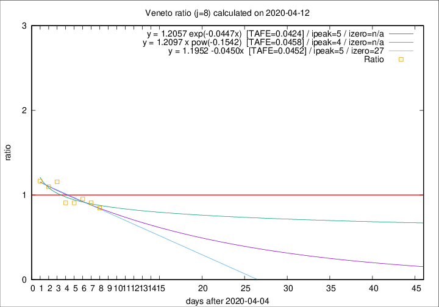

# Veneto

Data source: https://raw.githubusercontent.com/pcm-dpc/COVID-19/master/dati-json/dpc-covid19-ita-regioni.json

Estimates in this page were made on 12/4/2020 with data available until 12/04/2020.

## Summary 

### Peak estimate 
|j|linear [TAFE]|exponential [TAFE]|power law [TAFE]|details|
|---|----|-----------|---------|-------|
|7|-|-|8/4/2020 [TAFE=0.0643]|[analysis](COVID-19_veneto_j7_2020-04-12.md)|
|8|10/4/2020 [TAFE=0.0452]|10/4/2020 [TAFE=0.0424]|9/4/2020 [TAFE=0.0458]|[analysis](COVID-19_veneto_j8_2020-04-12.md)|
|9|11/4/2020 [TAFE=0.0689]|11/4/2020 [TAFE=0.0592]|11/4/2020 [TAFE=0.0475]|[analysis](COVID-19_veneto_j9_2020-04-12.md)|
|10|12/4/2020 [TAFE=0.0816]|12/4/2020 [TAFE=0.0567]|13/4/2020 [TAFE=0.0460]|[analysis](COVID-19_veneto_j10_2020-04-12.md)|
|11|13/4/2020 [TAFE=0.0753]|13/4/2020 [TAFE=0.0424]|17/4/2020 [TAFE=0.0843]|[analysis](COVID-19_veneto_j11_2020-04-12.md)|
|12|13/4/2020 [TAFE=0.0684]|14/4/2020 [TAFE=0.0406]|22/4/2020 [TAFE=0.1114]|[analysis](COVID-19_veneto_j12_2020-04-12.md)|
|13|13/4/2020 [TAFE=0.0749]|16/4/2020 [TAFE=0.0399]|30/4/2020 [TAFE=0.1094]|[analysis](COVID-19_veneto_j13_2020-04-12.md)|
|14|14/4/2020 [TAFE=0.0678]|17/4/2020 [TAFE=0.0326]|13/5/2020 [TAFE=0.1530]|[analysis](COVID-19_veneto_j14_2020-04-12.md)|

Best estimator is exp with j=14 (TAFE=0.0326)
Corresponding peak date estimate is 17/4/2020 (ipeak 18)

Peak date range estimate: 30/3/2020 - 13/5/2020

### End estimate 
|j|linear [TAFE/TFE]|exponential [TAFE/TFE]|power law [TAFE/TFE]|details|
|---|----|-----------|---------|-------|
|7|30/5/2020 [TAFE=0.0707]|-|-|[analysis](COVID-19_veneto_j7_2020-04-12.md)|
|8|2/5/2020 [TAFE=0.0452]|-|-|[analysis](COVID-19_veneto_j8_2020-04-12.md)|
|9|-|-|-|[analysis](COVID-19_veneto_j9_2020-04-12.md)|
|10|-|-|-|[analysis](COVID-19_veneto_j10_2020-04-12.md)|
|11|-|-|-|[analysis](COVID-19_veneto_j11_2020-04-12.md)|
|12|-|-|-|[analysis](COVID-19_veneto_j12_2020-04-12.md)|
|13|-|-|-|[analysis](COVID-19_veneto_j13_2020-04-12.md)|
|14|-|-|-|[analysis](COVID-19_veneto_j14_2020-04-12.md)|

Best estimator is linear with j=8 (TAFE=0.0452)
Corresponding end date estimate is 2/5/2020 (izero 27)

End date range estimate: 5/4/2020 - 29/5/2020

Generated April 12th, 2020 at 17:02:01 UTC+0200 with https://github.com/robianc/COVID-19
