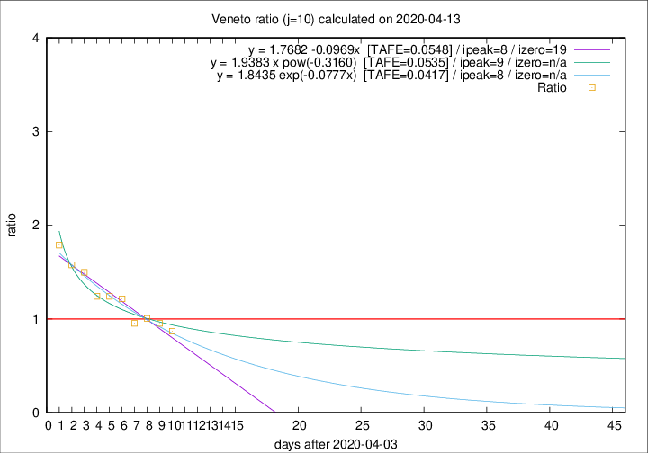

# Veneto

Data source: https://raw.githubusercontent.com/pcm-dpc/COVID-19/master/dati-json/dpc-covid19-ita-regioni.json

Delta days analysis (j): 10

Analyses for other values of j for 2020-04-13 are avalable [here](../2020-04-13/README.md)

Analyses for Veneto for previous dates are avalable [here](../README.md)

## Fitting 
|fit type|best fit equation|tafe|tfe|ipeak|izero|
|-------|-----|--------|------|---|---|
|linear|y = 1.7682 -0.0969x  [TAFE=0.0548]|0.0548|0.0025|8|19|
|exp|y = 1.8435 exp(-0.0777x)  [TAFE=0.0417]|0.0417|0.0013|8|n/a|
|pow|y = 1.9383 x pow(-0.3160)  [TAFE=0.0535]|0.0535|0.0022|9|n/a|

## Data
|Date|Daily deaths|Cumulated deaths|Deaths in the last 10 days|Deaths in the 10 days before|ratio|
|----|----------|-----------|-------|--------------------|-----|
|2020-04-13|26|882|310|356|0.8708|
|2020-04-12|25|856|324|340|0.9529|
|2020-04-11|38|831|332|330|1.0061|
|2020-04-10|37|793|316|331|0.9547|
|2020-04-09|20|756|343|282|1.2163|
|2020-04-08|41|736|344|277|1.2419|
|2020-04-07|33|695|333|268|1.2425|
|2020-04-06|31|662|349|233|1.4979|
|2020-04-05|24|631|344|218|1.5780|
|2020-04-04|35|607|349|195|1.7897|

[Download data as CSV](COVID-19_veneto_j10_2020-04-13.csv)

Generated April 14th, 2020 at 19:16:04 UTC+0200 with https://github.com/robianc/COVID-19
