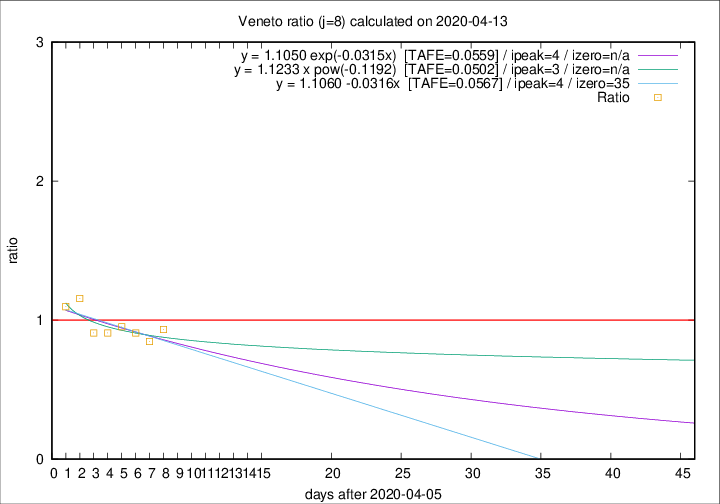

# Veneto

Data source: https://raw.githubusercontent.com/pcm-dpc/COVID-19/master/dati-json/dpc-covid19-ita-regioni.json

Delta days analysis (j): 8

Analyses for other values of j for 2020-04-13 are avalable [here](../2020-04-13/README.md)

Analyses for Veneto for previous dates are avalable [here](../README.md)

## Fitting 
|fit type|best fit equation|tafe|tfe|ipeak|izero|
|-------|-----|--------|------|---|---|
|linear|y = 1.1060 -0.0316x  [TAFE=0.0567]|0.0567|0.0044|4|35|
|exp|y = 1.1050 exp(-0.0315x)  [TAFE=0.0559]|0.0559|0.0021|4|n/a|
|pow|y = 1.1233 x pow(-0.1192)  [TAFE=0.0502]|0.0502|0.0018|3|n/a|

## Data
|Date|Daily deaths|Cumulated deaths|Deaths in the last 8 days|Deaths in the 8 days before|ratio|
|----|----------|-----------|-------|--------------------|-----|
|2020-04-13|26|882|251|269|0.9331|
|2020-04-12|25|856|249|294|0.8469|
|2020-04-11|38|831|259|285|0.9088|
|2020-04-10|37|793|261|274|0.9526|
|2020-04-09|20|756|257|283|0.9081|
|2020-04-08|41|736|259|285|0.9088|
|2020-04-07|33|695|282|244|1.1557|
|2020-04-06|31|662|270|246|1.0976|

[Download data as CSV](COVID-19_veneto_j8_2020-04-13.csv)

Generated April 19th, 2020 at 18:42:39 UTC+0200 with https://github.com/robianc/COVID-19
