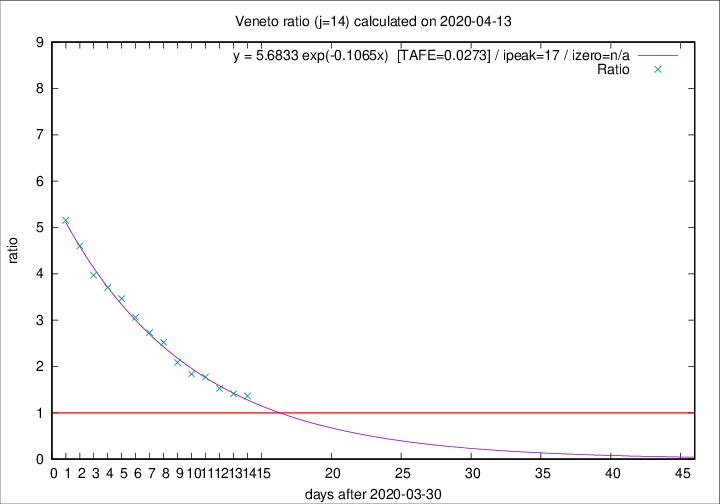
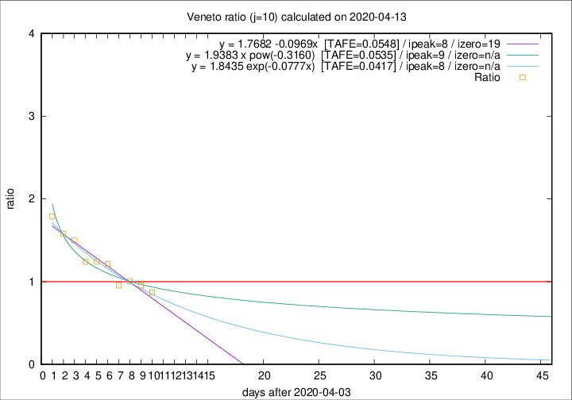

# Veneto

Data source: https://raw.githubusercontent.com/pcm-dpc/COVID-19/master/dati-json/dpc-covid19-ita-regioni.json

Estimates in this page were made on 19/4/2020 with data available until 13/04/2020.

## Summary 

### Peak estimate 
|j|linear [TAFE]|exponential [TAFE]|power law [TAFE]|details|
|---|----|-----------|---------|-------|
|7|9/4/2020 [TAFE=0.0439]|9/4/2020 [TAFE=0.0441]|9/4/2020 [TAFE=0.0423]|[analysis](COVID-19_veneto_j7_2020-04-13.md)|
|8|10/4/2020 [TAFE=0.0567]|10/4/2020 [TAFE=0.0559]|9/4/2020 [TAFE=0.0502]|[analysis](COVID-19_veneto_j8_2020-04-13.md)|
|9|12/4/2020 [TAFE=0.0627]|11/4/2020 [TAFE=0.0548]|11/4/2020 [TAFE=0.0384]|[analysis](COVID-19_veneto_j9_2020-04-13.md)|
|10|12/4/2020 [TAFE=0.0548]|12/4/2020 [TAFE=0.0417]|13/4/2020 [TAFE=0.0535]|[analysis](COVID-19_veneto_j10_2020-04-13.md)|
|11|13/4/2020 [TAFE=0.0826]|13/4/2020 [TAFE=0.0499]|15/4/2020 [TAFE=0.0696]|[analysis](COVID-19_veneto_j11_2020-04-13.md)|
|12|13/4/2020 [TAFE=0.0840]|14/4/2020 [TAFE=0.0450]|19/4/2020 [TAFE=0.0972]|[analysis](COVID-19_veneto_j12_2020-04-13.md)|
|13|14/4/2020 [TAFE=0.0684]|15/4/2020 [TAFE=0.0397]|26/4/2020 [TAFE=0.1264]|[analysis](COVID-19_veneto_j13_2020-04-13.md)|
|14|14/4/2020 [TAFE=0.0826]|17/4/2020 [TAFE=0.0273]|5/5/2020 [TAFE=0.1275]|[analysis](COVID-19_veneto_j14_2020-04-13.md)|

Best estimator is exp with j=14 (TAFE=0.0273)
Corresponding peak date estimate is 17/4/2020 (ipeak 17)

Peak date range estimate: 2/4/2020 - 5/5/2020

### End estimate 
|j|linear [TAFE/TFE]|exponential [TAFE/TFE]|power law [TAFE/TFE]|details|
|---|----|-----------|---------|-------|
|7|-|-|-|[analysis](COVID-19_veneto_j7_2020-04-13.md)|
|8|11/5/2020 [TAFE=0.0567]|-|-|[analysis](COVID-19_veneto_j8_2020-04-13.md)|
|9|-|-|-|[analysis](COVID-19_veneto_j9_2020-04-13.md)|
|10|23/4/2020 [TAFE=0.0548]|-|-|[analysis](COVID-19_veneto_j10_2020-04-13.md)|
|11|-|-|-|[analysis](COVID-19_veneto_j11_2020-04-13.md)|
|12|-|-|-|[analysis](COVID-19_veneto_j12_2020-04-13.md)|
|13|-|-|-|[analysis](COVID-19_veneto_j13_2020-04-13.md)|
|14|-|-|-|[analysis](COVID-19_veneto_j14_2020-04-13.md)|

Best estimator is linear with j=10 (TAFE=0.0548)
Corresponding end date estimate is 23/4/2020 (izero 19)

End date range estimate: 4/4/2020 - 9/5/2020

Generated April 19th, 2020 at 18:42:39 UTC+0200 with https://github.com/robianc/COVID-19
