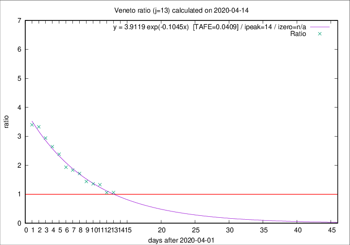

# Veneto

Data source: https://raw.githubusercontent.com/pcm-dpc/COVID-19/master/dati-json/dpc-covid19-ita-regioni.json

Delta days analysis (j): 13

Analyses for other values of j for 2020-04-14 are avalable [here](../2020-04-14/README.md)

Analyses for Veneto for previous dates are avalable [here](../README.md)

## Fitting 
|fit type|best fit equation|tafe|tfe|ipeak|izero|
|-------|-----|--------|------|---|---|
|exp|y = 3.9119 exp(-0.1045x)  [TAFE=0.0409]|0.0409|0.0010|14|n/a|

## Data
|Date|Daily deaths|Cumulated deaths|Deaths in the last 13 days|Deaths in the 13 days before|ratio|
|----|----------|-----------|-------|--------------------|-----|
|2020-04-14|24|906|407|384|1.0599|
|2020-04-13|26|882|405|383|1.0574|
|2020-04-12|25|856|443|333|1.3303|
|2020-04-11|38|831|439|323|1.3591|
|2020-04-10|37|793|431|299|1.4415|
|2020-04-09|20|756|443|258|1.7171|
|2020-04-08|41|736|449|245|1.8327|
|2020-04-07|33|695|437|226|1.9336|
|2020-04-06|31|662|446|187|2.3850|
|2020-04-05|24|631|439|166|2.6446|
|2020-04-04|35|607|438|149|2.9396|
|2020-04-03|40|572|426|128|3.3281|
|2020-04-02|33|532|401|118|3.3983|

[Download data as CSV](COVID-19_veneto_j13_2020-04-14.csv)

Generated April 14th, 2020 at 19:16:04 UTC+0200 with https://github.com/robianc/COVID-19
