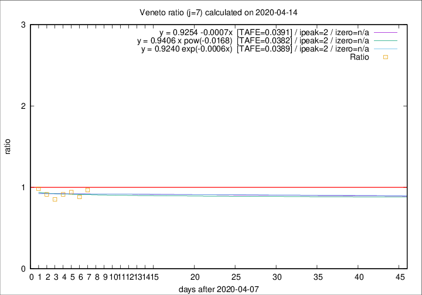

# Veneto

Data source: https://raw.githubusercontent.com/pcm-dpc/COVID-19/master/dati-json/dpc-covid19-ita-regioni.json

Delta days analysis (j): 7

Analyses for other values of j for 2020-04-14 are avalable [here](../2020-04-14/README.md)

Analyses for Veneto for previous dates are avalable [here](../README.md)

## Fitting 
|fit type|best fit equation|tafe|tfe|ipeak|izero|
|-------|-----|--------|------|---|---|
|linear|y = 0.9254 -0.0007x  [TAFE=0.0391]|0.0391|0.0021|2|n/a|
|exp|y = 0.9240 exp(-0.0006x)  [TAFE=0.0389]|0.0389|0.0013|2|n/a|
|pow|y = 0.9406 x pow(-0.0168)  [TAFE=0.0382]|0.0382|0.0010|2|n/a|

## Data
|Date|Daily deaths|Cumulated deaths|Deaths in the last 7 days|Deaths in the 7 days before|ratio|
|----|----------|-----------|-------|--------------------|-----|
|2020-04-14|24|906|211|218|0.9679|
|2020-04-13|26|882|220|249|0.8835|
|2020-04-12|25|856|225|239|0.9414|
|2020-04-11|38|831|224|245|0.9143|
|2020-04-10|37|793|221|259|0.8533|
|2020-04-09|20|756|224|245|0.9143|
|2020-04-08|41|736|237|241|0.9834|

[Download data as CSV](COVID-19_veneto_j7_2020-04-14.csv)

Generated April 16th, 2020 at 20:09:19 UTC+0200 with https://github.com/robianc/COVID-19
