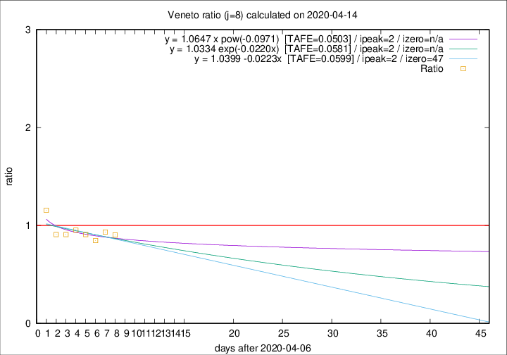

# Veneto

Data source: https://raw.githubusercontent.com/pcm-dpc/COVID-19/master/dati-json/dpc-covid19-ita-regioni.json

Delta days analysis (j): 8

Analyses for other values of j for 2020-04-14 are avalable [here](../2020-04-14/README.md)

Analyses for Veneto for previous dates are avalable [here](../README.md)

## Fitting 
|fit type|best fit equation|tafe|tfe|ipeak|izero|
|-------|-----|--------|------|---|---|
|linear|y = 1.0399 -0.0223x  [TAFE=0.0599]|0.0599|0.0046|2|47|
|exp|y = 1.0334 exp(-0.0220x)  [TAFE=0.0581]|0.0581|0.0023|2|n/a|
|pow|y = 1.0647 x pow(-0.0971)  [TAFE=0.0503]|0.0503|0.0016|2|n/a|

## Data
|Date|Daily deaths|Cumulated deaths|Deaths in the last 8 days|Deaths in the 8 days before|ratio|
|----|----------|-----------|-------|--------------------|-----|
|2020-04-14|24|906|244|270|0.9037|
|2020-04-13|26|882|251|269|0.9331|
|2020-04-12|25|856|249|294|0.8469|
|2020-04-11|38|831|259|285|0.9088|
|2020-04-10|37|793|261|274|0.9526|
|2020-04-09|20|756|257|283|0.9081|
|2020-04-08|41|736|259|285|0.9088|
|2020-04-07|33|695|282|244|1.1557|

[Download data as CSV](COVID-19_veneto_j8_2020-04-14.csv)

Generated April 14th, 2020 at 19:16:04 UTC+0200 with https://github.com/robianc/COVID-19
