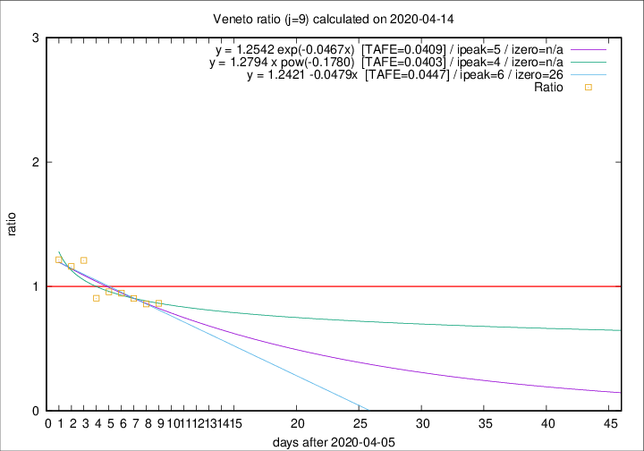

# Veneto

Data source: https://raw.githubusercontent.com/pcm-dpc/COVID-19/master/dati-json/dpc-covid19-ita-regioni.json

Estimates in this page were made on 16/4/2020 with data available until 14/04/2020.

## Summary 

### Peak estimate 
|j|linear [TAFE]|exponential [TAFE]|power law [TAFE]|details|
|---|----|-----------|---------|-------|
|7|10/4/2020 [TAFE=0.0391]|10/4/2020 [TAFE=0.0389]|10/4/2020 [TAFE=0.0382]|[analysis](COVID-19_veneto_j7_2020-04-14.md)|
|8|9/4/2020 [TAFE=0.0599]|9/4/2020 [TAFE=0.0581]|9/4/2020 [TAFE=0.0503]|[analysis](COVID-19_veneto_j8_2020-04-14.md)|
|9|12/4/2020 [TAFE=0.0447]|11/4/2020 [TAFE=0.0409]|10/4/2020 [TAFE=0.0403]|[analysis](COVID-19_veneto_j9_2020-04-14.md)|
|10|13/4/2020 [TAFE=0.0507]|13/4/2020 [TAFE=0.0398]|12/4/2020 [TAFE=0.0531]|[analysis](COVID-19_veneto_j10_2020-04-14.md)|
|11|13/4/2020 [TAFE=0.0726]|14/4/2020 [TAFE=0.0458]|14/4/2020 [TAFE=0.0522]|[analysis](COVID-19_veneto_j11_2020-04-14.md)|
|12|14/4/2020 [TAFE=0.0890]|15/4/2020 [TAFE=0.0515]|18/4/2020 [TAFE=0.0827]|[analysis](COVID-19_veneto_j12_2020-04-14.md)|
|13|14/4/2020 [TAFE=0.0825]|16/4/2020 [TAFE=0.0409]|22/4/2020 [TAFE=0.1146]|[analysis](COVID-19_veneto_j13_2020-04-14.md)|
|14|15/4/2020 [TAFE=0.0818]|17/4/2020 [TAFE=0.0304]|29/4/2020 [TAFE=0.1327]|[analysis](COVID-19_veneto_j14_2020-04-14.md)|

Best estimator is exp with j=14 (TAFE=0.0304)
Corresponding peak date estimate is 17/4/2020 (ipeak 16)

Peak date range estimate: 3/4/2020 - 29/4/2020

### End estimate 
|j|linear [TAFE/TFE]|exponential [TAFE/TFE]|power law [TAFE/TFE]|details|
|---|----|-----------|---------|-------|
|7|-|-|-|[analysis](COVID-19_veneto_j7_2020-04-14.md)|
|8|24/5/2020 [TAFE=0.0599]|-|-|[analysis](COVID-19_veneto_j8_2020-04-14.md)|
|9|2/5/2020 [TAFE=0.0447]|-|-|[analysis](COVID-19_veneto_j9_2020-04-14.md)|
|10|-|-|-|[analysis](COVID-19_veneto_j10_2020-04-14.md)|
|11|-|-|-|[analysis](COVID-19_veneto_j11_2020-04-14.md)|
|12|-|-|-|[analysis](COVID-19_veneto_j12_2020-04-14.md)|
|13|-|-|-|[analysis](COVID-19_veneto_j13_2020-04-14.md)|
|14|-|-|-|[analysis](COVID-19_veneto_j14_2020-04-14.md)|

Best estimator is linear with j=9 (TAFE=0.0447)
Corresponding end date estimate is 2/5/2020 (izero 26)

End date range estimate: 6/4/2020 - 23/5/2020

Generated April 16th, 2020 at 20:09:19 UTC+0200 with https://github.com/robianc/COVID-19
