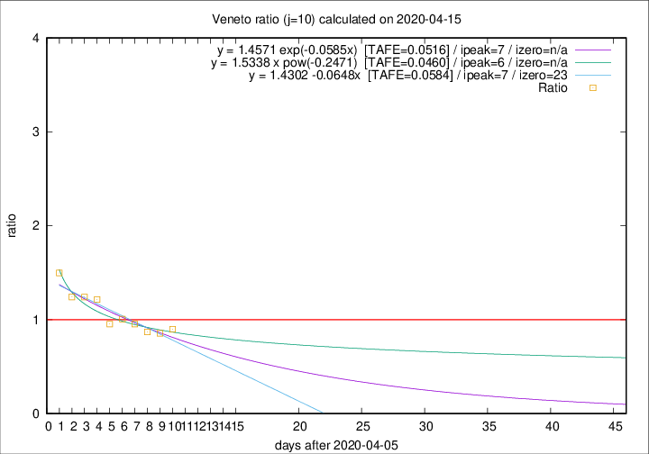

# Veneto

Data source: https://raw.githubusercontent.com/pcm-dpc/COVID-19/master/dati-json/dpc-covid19-ita-regioni.json

Delta days analysis (j): 10

Analyses for other values of j for 2020-04-15 are avalable [here](../2020-04-15/README.md)

Analyses for Veneto for previous dates are avalable [here](../README.md)

## Fitting 
|fit type|best fit equation|tafe|tfe|ipeak|izero|
|-------|-----|--------|------|---|---|
|linear|y = 1.4302 -0.0648x  [TAFE=0.0584]|0.0584|0.0041|7|23|
|exp|y = 1.4571 exp(-0.0585x)  [TAFE=0.0516]|0.0516|0.0023|7|n/a|
|pow|y = 1.5338 x pow(-0.2471)  [TAFE=0.0460]|0.0460|0.0015|6|n/a|

## Data
|Date|Daily deaths|Cumulated deaths|Deaths in the last 10 days|Deaths in the 10 days before|ratio|
|----|----------|-----------|-------|--------------------|-----|
|2020-04-15|34|940|309|344|0.8983|
|2020-04-14|24|906|299|349|0.8567|
|2020-04-13|26|882|310|356|0.8708|
|2020-04-12|25|856|324|340|0.9529|
|2020-04-11|38|831|332|330|1.0061|
|2020-04-10|37|793|316|331|0.9547|
|2020-04-09|20|756|343|282|1.2163|
|2020-04-08|41|736|344|277|1.2419|
|2020-04-07|33|695|333|268|1.2425|
|2020-04-06|31|662|349|233|1.4979|

[Download data as CSV](COVID-19_veneto_j10_2020-04-15.csv)

Generated April 16th, 2020 at 20:09:19 UTC+0200 with https://github.com/robianc/COVID-19
