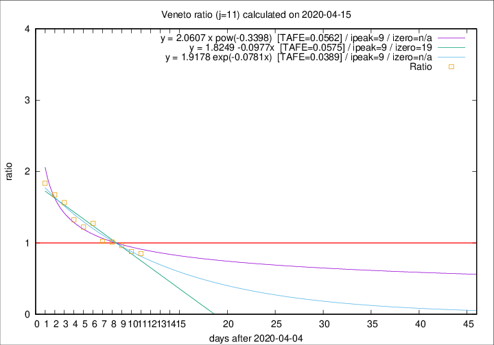

# Veneto

Data source: https://raw.githubusercontent.com/pcm-dpc/COVID-19/master/dati-json/dpc-covid19-ita-regioni.json

Delta days analysis (j): 11

Analyses for other values of j for 2020-04-15 are avalable [here](../2020-04-15/README.md)

Analyses for Veneto for previous dates are avalable [here](../README.md)

## Fitting 
|fit type|best fit equation|tafe|tfe|ipeak|izero|
|-------|-----|--------|------|---|---|
|linear|y = 1.8249 -0.0977x  [TAFE=0.0575]|0.0575|0.0011|9|19|
|exp|y = 1.9178 exp(-0.0781x)  [TAFE=0.0389]|0.0389|0.0013|9|n/a|
|pow|y = 2.0607 x pow(-0.3398)  [TAFE=0.0562]|0.0562|0.0025|9|n/a|

## Data
|Date|Daily deaths|Cumulated deaths|Deaths in the last 11 days|Deaths in the 11 days before|ratio|
|----|----------|-----------|-------|--------------------|-----|
|2020-04-15|34|940|333|391|0.8517|
|2020-04-14|24|906|334|380|0.8789|
|2020-04-13|26|882|350|363|0.9642|
|2020-04-12|25|856|357|353|1.0113|
|2020-04-11|38|831|354|346|1.0231|
|2020-04-10|37|793|380|298|1.2752|
|2020-04-09|20|756|364|298|1.2215|
|2020-04-08|41|736|374|282|1.3262|
|2020-04-07|33|695|382|244|1.5656|
|2020-04-06|31|662|375|224|1.6741|
|2020-04-05|24|631|373|203|1.8374|

[Download data as CSV](COVID-19_veneto_j11_2020-04-15.csv)

Generated April 19th, 2020 at 18:42:39 UTC+0200 with https://github.com/robianc/COVID-19
