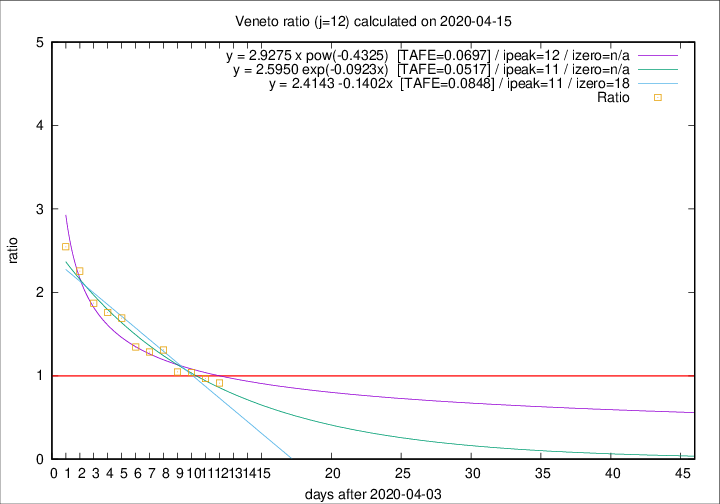

# Veneto

Data source: https://raw.githubusercontent.com/pcm-dpc/COVID-19/master/dati-json/dpc-covid19-ita-regioni.json

Delta days analysis (j): 12

Analyses for other values of j for 2020-04-15 are avalable [here](../2020-04-15/README.md)

Analyses for Veneto for previous dates are avalable [here](../README.md)

## Fitting 
|fit type|best fit equation|tafe|tfe|ipeak|izero|
|-------|-----|--------|------|---|---|
|linear|y = 2.4143 -0.1402x  [TAFE=0.0848]|0.0848|0.0015|11|18|
|exp|y = 2.5950 exp(-0.0923x)  [TAFE=0.0517]|0.0517|0.0015|11|n/a|
|pow|y = 2.9275 x pow(-0.4325)  [TAFE=0.0697]|0.0697|0.0034|12|n/a|

## Data
|Date|Daily deaths|Cumulated deaths|Deaths in the last 12 days|Deaths in the 12 days before|ratio|
|----|----------|-----------|-------|--------------------|-----|
|2020-04-15|34|940|368|403|0.9132|
|2020-04-14|24|906|374|386|0.9689|
|2020-04-13|26|882|383|368|1.0408|
|2020-04-12|25|856|379|362|1.0470|
|2020-04-11|38|831|418|319|1.3103|
|2020-04-10|37|793|401|312|1.2853|
|2020-04-09|20|756|394|293|1.3447|
|2020-04-08|41|736|423|250|1.6920|
|2020-04-07|33|695|408|232|1.7586|
|2020-04-06|31|662|404|216|1.8704|
|2020-04-05|24|631|415|184|2.2554|
|2020-04-04|35|607|415|163|2.5460|

[Download data as CSV](COVID-19_veneto_j12_2020-04-15.csv)

Generated April 16th, 2020 at 20:09:19 UTC+0200 with https://github.com/robianc/COVID-19
