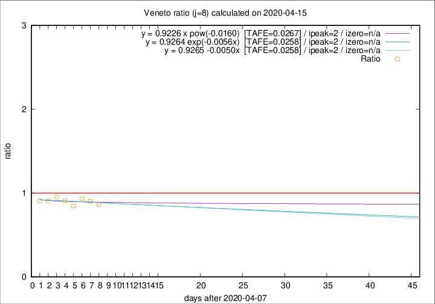
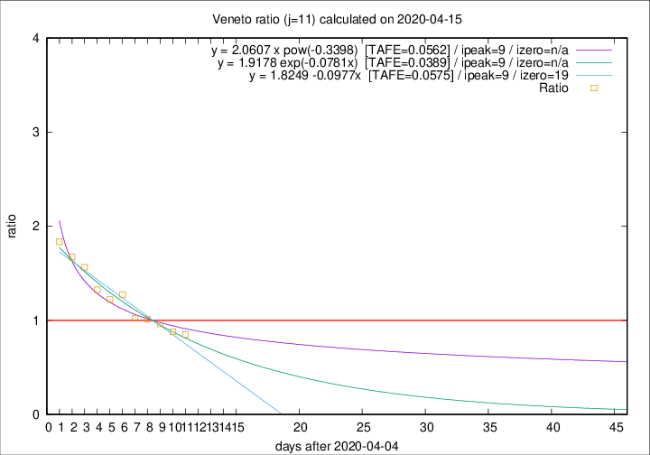

# Veneto

Data source: https://raw.githubusercontent.com/pcm-dpc/COVID-19/master/dati-json/dpc-covid19-ita-regioni.json

Estimates in this page were made on 16/4/2020 with data available until 15/04/2020.

## Summary 

### Peak estimate 
|j|linear [TAFE]|exponential [TAFE]|power law [TAFE]|details|
|---|----|-----------|---------|-------|
|7|11/4/2020 [TAFE=0.0381]|11/4/2020 [TAFE=0.0380]|11/4/2020 [TAFE=0.0383]|[analysis](COVID-19_veneto_j7_2020-04-15.md)|
|8|10/4/2020 [TAFE=0.0258]|10/4/2020 [TAFE=0.0258]|10/4/2020 [TAFE=0.0267]|[analysis](COVID-19_veneto_j8_2020-04-15.md)|
|9|12/4/2020 [TAFE=0.0627]|11/4/2020 [TAFE=0.0599]|11/4/2020 [TAFE=0.0448]|[analysis](COVID-19_veneto_j9_2020-04-15.md)|
|10|13/4/2020 [TAFE=0.0584]|13/4/2020 [TAFE=0.0516]|12/4/2020 [TAFE=0.0460]|[analysis](COVID-19_veneto_j10_2020-04-15.md)|
|11|14/4/2020 [TAFE=0.0575]|14/4/2020 [TAFE=0.0389]|14/4/2020 [TAFE=0.0562]|[analysis](COVID-19_veneto_j11_2020-04-15.md)|
|12|15/4/2020 [TAFE=0.0848]|15/4/2020 [TAFE=0.0517]|16/4/2020 [TAFE=0.0697]|[analysis](COVID-19_veneto_j12_2020-04-15.md)|
|13|15/4/2020 [TAFE=0.0976]|16/4/2020 [TAFE=0.0460]|20/4/2020 [TAFE=0.0891]|[analysis](COVID-19_veneto_j13_2020-04-15.md)|
|14|15/4/2020 [TAFE=0.0882]|17/4/2020 [TAFE=0.0350]|26/4/2020 [TAFE=0.1284]|[analysis](COVID-19_veneto_j14_2020-04-15.md)|

Best estimator is linear with j=8 (TAFE=0.0258)
Corresponding peak date estimate is 10/4/2020 (ipeak 2)

Peak date range estimate: 10/4/2020 - 2/5/2020

### End estimate 
|j|linear [TAFE/TFE]|exponential [TAFE/TFE]|power law [TAFE/TFE]|details|
|---|----|-----------|---------|-------|
|7|-|-|-|[analysis](COVID-19_veneto_j7_2020-04-15.md)|
|8|-|-|-|[analysis](COVID-19_veneto_j8_2020-04-15.md)|
|9|10/5/2020 [TAFE=0.0627]|-|-|[analysis](COVID-19_veneto_j9_2020-04-15.md)|
|10|29/4/2020 [TAFE=0.0584]|-|-|[analysis](COVID-19_veneto_j10_2020-04-15.md)|
|11|24/4/2020 [TAFE=0.0575]|-|-|[analysis](COVID-19_veneto_j11_2020-04-15.md)|
|12|-|-|-|[analysis](COVID-19_veneto_j12_2020-04-15.md)|
|13|-|-|-|[analysis](COVID-19_veneto_j13_2020-04-15.md)|
|14|-|-|-|[analysis](COVID-19_veneto_j14_2020-04-15.md)|

Best estimator is linear with j=11 (TAFE=0.0575)
Corresponding end date estimate is 24/4/2020 (izero 19)

End date range estimate: 5/4/2020 - 8/5/2020

Generated April 16th, 2020 at 20:09:19 UTC+0200 with https://github.com/robianc/COVID-19
