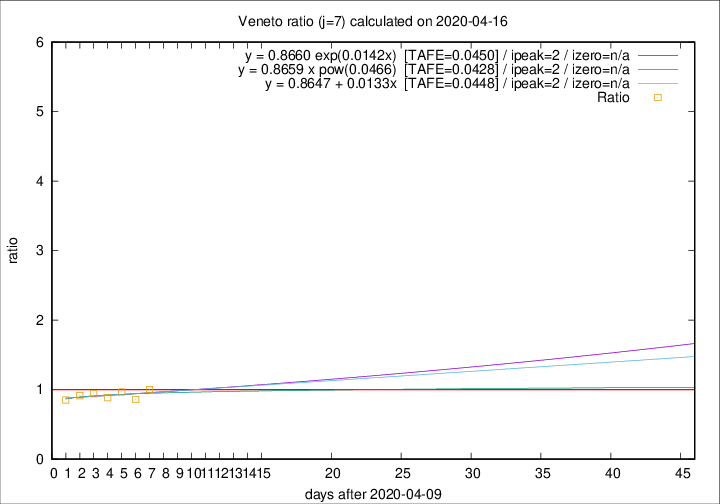

# Veneto

Data source: https://raw.githubusercontent.com/pcm-dpc/COVID-19/master/dati-json/dpc-covid19-ita-regioni.json

Delta days analysis (j): 7

Analyses for other values of j for 2020-04-16 are avalable [here](../2020-04-16/README.md)

Analyses for Veneto for previous dates are avalable [here](../README.md)

## Fitting 
|fit type|best fit equation|tafe|tfe|ipeak|izero|
|-------|-----|--------|------|---|---|
|linear|y = 0.8647 + 0.0133x  [TAFE=0.0448]|0.0448|0.0024|2|n/a|
|exp|y = 0.8660 exp(0.0142x)  [TAFE=0.0450]|0.0450|0.0014|2|n/a|
|pow|y = 0.8659 x pow(0.0466)  [TAFE=0.0428]|0.0428|0.0012|2|n/a|

## Data
|Date|Daily deaths|Cumulated deaths|Deaths in the last 7 days|Deaths in the 7 days before|ratio|
|----|----------|-----------|-------|--------------------|-----|
|2020-04-16|41|981|225|224|1.0045|
|2020-04-15|34|940|204|237|0.8608|
|2020-04-14|24|906|211|218|0.9679|
|2020-04-13|26|882|220|249|0.8835|
|2020-04-12|25|856|225|239|0.9414|
|2020-04-11|38|831|224|245|0.9143|
|2020-04-10|37|793|221|259|0.8533|

[Download data as CSV](COVID-19_veneto_j7_2020-04-16.csv)

Generated April 19th, 2020 at 18:42:39 UTC+0200 with https://github.com/robianc/COVID-19
