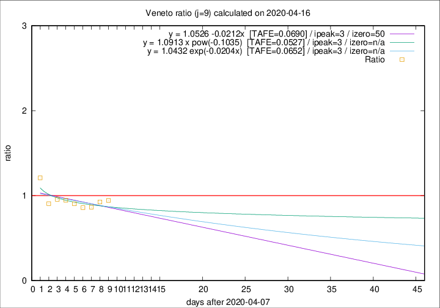

# Veneto

Data source: https://raw.githubusercontent.com/pcm-dpc/COVID-19/master/dati-json/dpc-covid19-ita-regioni.json

Delta days analysis (j): 9

Analyses for other values of j for 2020-04-16 are avalable [here](../2020-04-16/README.md)

Analyses for Veneto for previous dates are avalable [here](../README.md)

## Fitting 
|fit type|best fit equation|tafe|tfe|ipeak|izero|
|-------|-----|--------|------|---|---|
|linear|y = 1.0526 -0.0212x  [TAFE=0.0690]|0.0690|0.0065|3|50|
|exp|y = 1.0432 exp(-0.0204x)  [TAFE=0.0652]|0.0652|0.0032|3|n/a|
|pow|y = 1.0913 x pow(-0.1035)  [TAFE=0.0527]|0.0527|0.0020|3|n/a|

## Data
|Date|Daily deaths|Cumulated deaths|Deaths in the last 9 days|Deaths in the 9 days before|ratio|
|----|----------|-----------|-------|--------------------|-----|
|2020-04-16|41|981|286|303|0.9439|
|2020-04-15|34|940|278|300|0.9267|
|2020-04-14|24|906|275|318|0.8648|
|2020-04-13|26|882|275|320|0.8594|
|2020-04-12|25|856|284|314|0.9045|
|2020-04-11|38|831|299|316|0.9462|
|2020-04-10|37|793|294|307|0.9577|
|2020-04-09|20|756|279|308|0.9058|
|2020-04-08|41|736|323|267|1.2097|

[Download data as CSV](COVID-19_veneto_j9_2020-04-16.csv)

Generated April 19th, 2020 at 18:42:39 UTC+0200 with https://github.com/robianc/COVID-19
