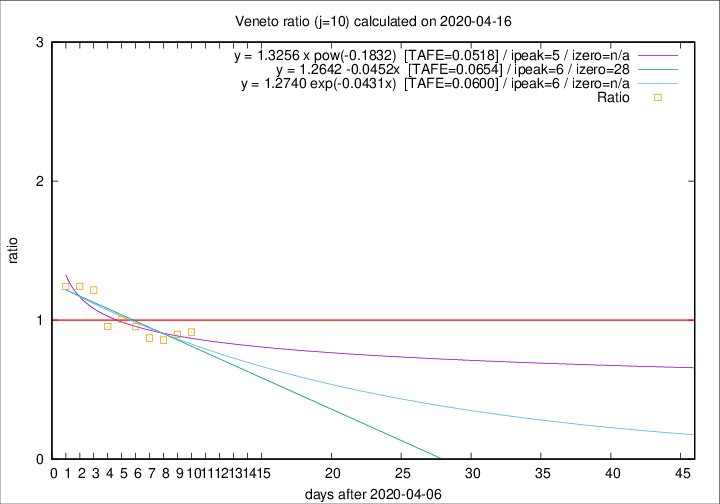

# Veneto

Data source: https://raw.githubusercontent.com/pcm-dpc/COVID-19/master/dati-json/dpc-covid19-ita-regioni.json

Estimates in this page were made on 16/4/2020 with data available until 16/04/2020.

## Summary 

### Peak estimate 
|j|linear [TAFE]|exponential [TAFE]|power law [TAFE]|details|
|---|----|-----------|---------|-------|
|7|12/4/2020 [TAFE=0.0448]|12/4/2020 [TAFE=0.0450]|12/4/2020 [TAFE=0.0428]|[analysis](COVID-19_veneto_j7_2020-04-16.md)|
|8|11/4/2020 [TAFE=0.0299]|11/4/2020 [TAFE=0.0297]|11/4/2020 [TAFE=0.0300]|[analysis](COVID-19_veneto_j8_2020-04-16.md)|
|9|11/4/2020 [TAFE=0.0690]|11/4/2020 [TAFE=0.0652]|11/4/2020 [TAFE=0.0527]|[analysis](COVID-19_veneto_j9_2020-04-16.md)|
|10|13/4/2020 [TAFE=0.0654]|13/4/2020 [TAFE=0.0600]|12/4/2020 [TAFE=0.0518]|[analysis](COVID-19_veneto_j10_2020-04-16.md)|
|11|14/4/2020 [TAFE=0.0700]|14/4/2020 [TAFE=0.0590]|14/4/2020 [TAFE=0.0498]|[analysis](COVID-19_veneto_j11_2020-04-16.md)|
|12|15/4/2020 [TAFE=0.0712]|15/4/2020 [TAFE=0.0489]|16/4/2020 [TAFE=0.0622]|[analysis](COVID-19_veneto_j12_2020-04-16.md)|
|13|16/4/2020 [TAFE=0.1012]|16/4/2020 [TAFE=0.0504]|19/4/2020 [TAFE=0.0840]|[analysis](COVID-19_veneto_j13_2020-04-16.md)|
|14|16/4/2020 [TAFE=0.1023]|17/4/2020 [TAFE=0.0431]|23/4/2020 [TAFE=0.1074]|[analysis](COVID-19_veneto_j14_2020-04-16.md)|

Best estimator is exp with j=8 (TAFE=0.0297)
Corresponding peak date estimate is 11/4/2020 (ipeak 2)

Peak date range estimate: 11/4/2020 - 29/4/2020

### End estimate 
|j|linear [TAFE/TFE]|exponential [TAFE/TFE]|power law [TAFE/TFE]|details|
|---|----|-----------|---------|-------|
|7|-|-|-|[analysis](COVID-19_veneto_j7_2020-04-16.md)|
|8|-|-|-|[analysis](COVID-19_veneto_j8_2020-04-16.md)|
|9|28/5/2020 [TAFE=0.0690]|-|-|[analysis](COVID-19_veneto_j9_2020-04-16.md)|
|10|5/5/2020 [TAFE=0.0654]|-|-|[analysis](COVID-19_veneto_j10_2020-04-16.md)|
|11|-|-|-|[analysis](COVID-19_veneto_j11_2020-04-16.md)|
|12|-|-|-|[analysis](COVID-19_veneto_j12_2020-04-16.md)|
|13|-|-|-|[analysis](COVID-19_veneto_j13_2020-04-16.md)|
|14|-|-|-|[analysis](COVID-19_veneto_j14_2020-04-16.md)|

Best estimator is linear with j=10 (TAFE=0.0654)
Corresponding end date estimate is 5/5/2020 (izero 28)

End date range estimate: 7/4/2020 - 27/5/2020

Generated April 16th, 2020 at 20:09:19 UTC+0200 with https://github.com/robianc/COVID-19
