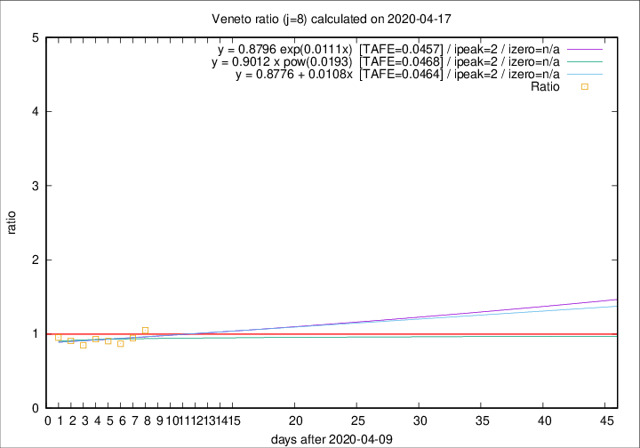

# Veneto

Data source: https://raw.githubusercontent.com/pcm-dpc/COVID-19/master/dati-json/dpc-covid19-ita-regioni.json

Delta days analysis (j): 8

Analyses for other values of j for 2020-04-17 are avalable [here](../2020-04-17/README.md)

Analyses for Veneto for previous dates are avalable [here](../README.md)

## Fitting 
|fit type|best fit equation|tafe|tfe|ipeak|izero|
|-------|-----|--------|------|---|---|
|linear|y = 0.8776 + 0.0108x  [TAFE=0.0464]|0.0464|0.0030|2|n/a|
|exp|y = 0.8796 exp(0.0111x)  [TAFE=0.0457]|0.0457|0.0017|2|n/a|
|pow|y = 0.9012 x pow(0.0193)  [TAFE=0.0468]|0.0468|0.0018|2|n/a|

## Data
|Date|Daily deaths|Cumulated deaths|Deaths in the last 8 days|Deaths in the 8 days before|ratio|
|----|----------|-----------|-------|--------------------|-----|
|2020-04-17|45|1026|270|257|1.0506|
|2020-04-16|41|981|245|259|0.9459|
|2020-04-15|34|940|245|282|0.8688|
|2020-04-14|24|906|244|270|0.9037|
|2020-04-13|26|882|251|269|0.9331|
|2020-04-12|25|856|249|294|0.8469|
|2020-04-11|38|831|259|285|0.9088|
|2020-04-10|37|793|261|274|0.9526|

[Download data as CSV](COVID-19_veneto_j8_2020-04-17.csv)

Generated April 19th, 2020 at 18:42:39 UTC+0200 with https://github.com/robianc/COVID-19
