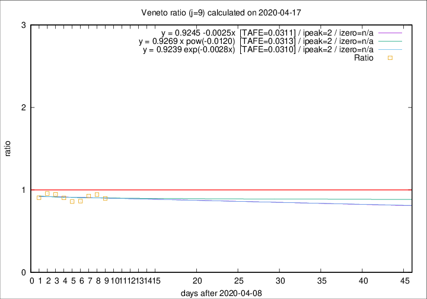
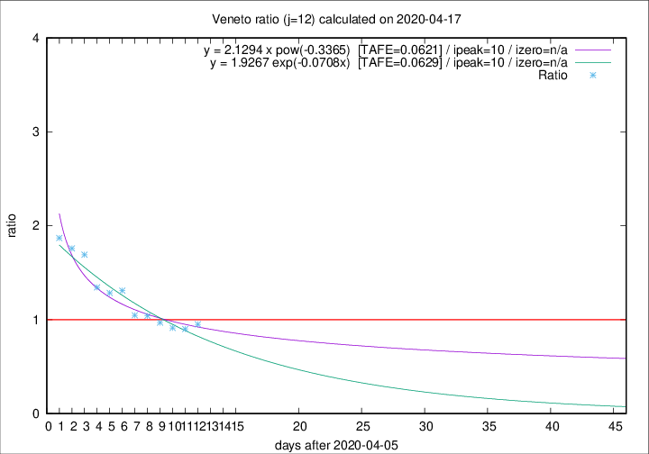

# Veneto

Data source: https://raw.githubusercontent.com/pcm-dpc/COVID-19/master/dati-json/dpc-covid19-ita-regioni.json

Estimates in this page were made on 19/4/2020 with data available until 17/04/2020.

## Summary 

### Peak estimate 
|j|linear [TAFE]|exponential [TAFE]|power law [TAFE]|details|
|---|----|-----------|---------|-------|
|7|13/4/2020 [TAFE=0.0461]|13/4/2020 [TAFE=0.0463]|13/4/2020 [TAFE=0.0499]|[analysis](COVID-19_veneto_j7_2020-04-17.md)|
|8|12/4/2020 [TAFE=0.0464]|12/4/2020 [TAFE=0.0457]|12/4/2020 [TAFE=0.0468]|[analysis](COVID-19_veneto_j8_2020-04-17.md)|
|9|11/4/2020 [TAFE=0.0311]|11/4/2020 [TAFE=0.0310]|11/4/2020 [TAFE=0.0313]|[analysis](COVID-19_veneto_j9_2020-04-17.md)|
|10|14/4/2020 [TAFE=0.0809]|13/4/2020 [TAFE=0.0767]|13/4/2020 [TAFE=0.0531]|[analysis](COVID-19_veneto_j10_2020-04-17.md)|
|11|15/4/2020 [TAFE=0.0850]|15/4/2020 [TAFE=0.0756]|14/4/2020 [TAFE=0.0475]|[analysis](COVID-19_veneto_j11_2020-04-17.md)|
|12|16/4/2020 [TAFE=0.0803]|16/4/2020 [TAFE=0.0629]|16/4/2020 [TAFE=0.0621]|[analysis](COVID-19_veneto_j12_2020-04-17.md)|
|13|16/4/2020 [TAFE=0.1007]|17/4/2020 [TAFE=0.0550]|18/4/2020 [TAFE=0.0694]|[analysis](COVID-19_veneto_j13_2020-04-17.md)|
|14|17/4/2020 [TAFE=0.1163]|18/4/2020 [TAFE=0.0558]|22/4/2020 [TAFE=0.0906]|[analysis](COVID-19_veneto_j14_2020-04-17.md)|

Best estimator is exp with j=9 (TAFE=0.0310)
Corresponding peak date estimate is 11/4/2020 (ipeak 2)

Peak date range estimate: 11/4/2020 - 27/4/2020

### End estimate 
|j|linear [TAFE/TFE]|exponential [TAFE/TFE]|power law [TAFE/TFE]|details|
|---|----|-----------|---------|-------|
|7|-|-|-|[analysis](COVID-19_veneto_j7_2020-04-17.md)|
|8|-|-|-|[analysis](COVID-19_veneto_j8_2020-04-17.md)|
|9|-|-|-|[analysis](COVID-19_veneto_j9_2020-04-17.md)|
|10|16/5/2020 [TAFE=0.0809]|-|-|[analysis](COVID-19_veneto_j10_2020-04-17.md)|
|11|-|-|-|[analysis](COVID-19_veneto_j11_2020-04-17.md)|
|12|27/4/2020 [TAFE=0.0803]|-|-|[analysis](COVID-19_veneto_j12_2020-04-17.md)|
|13|-|-|-|[analysis](COVID-19_veneto_j13_2020-04-17.md)|
|14|-|-|-|[analysis](COVID-19_veneto_j14_2020-04-17.md)|

Best estimator is linear with j=12 (TAFE=0.0803)
Corresponding end date estimate is 27/4/2020 (izero 21)

End date range estimate: 6/4/2020 - 14/5/2020

Generated April 19th, 2020 at 18:42:39 UTC+0200 with https://github.com/robianc/COVID-19
