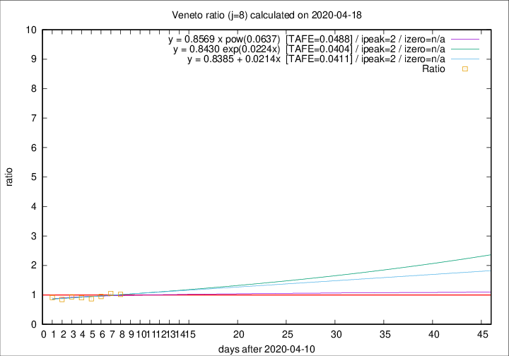

# Veneto

Data source: https://raw.githubusercontent.com/pcm-dpc/COVID-19/master/dati-json/dpc-covid19-ita-regioni.json

Delta days analysis (j): 8

Analyses for other values of j for 2020-04-18 are avalable [here](../2020-04-18/README.md)

Analyses for Veneto for previous dates are avalable [here](../README.md)

## Fitting 
|fit type|best fit equation|tafe|tfe|ipeak|izero|
|-------|-----|--------|------|---|---|
|linear|y = 0.8385 + 0.0214x  [TAFE=0.0411]|0.0411|0.0023|2|n/a|
|exp|y = 0.8430 exp(0.0224x)  [TAFE=0.0404]|0.0404|0.0011|2|n/a|
|pow|y = 0.8569 x pow(0.0637)  [TAFE=0.0488]|0.0488|0.0015|2|n/a|

## Data
|Date|Daily deaths|Cumulated deaths|Deaths in the last 8 days|Deaths in the 8 days before|ratio|
|----|----------|-----------|-------|--------------------|-----|
|2020-04-18|33|1059|266|261|1.0192|
|2020-04-17|45|1026|270|257|1.0506|
|2020-04-16|41|981|245|259|0.9459|
|2020-04-15|34|940|245|282|0.8688|
|2020-04-14|24|906|244|270|0.9037|
|2020-04-13|26|882|251|269|0.9331|
|2020-04-12|25|856|249|294|0.8469|
|2020-04-11|38|831|259|285|0.9088|

[Download data as CSV](COVID-19_veneto_j8_2020-04-18.csv)

Generated April 19th, 2020 at 18:42:39 UTC+0200 with https://github.com/robianc/COVID-19
