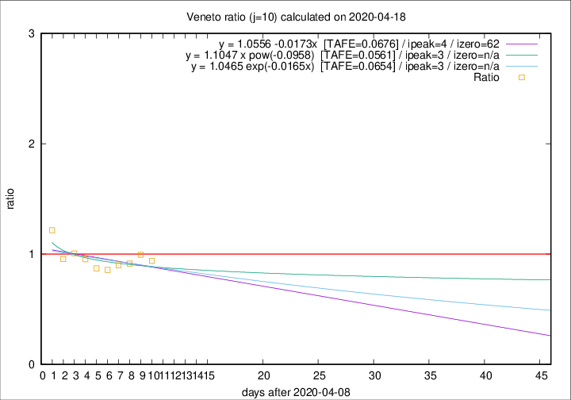

# Veneto

Data source: https://raw.githubusercontent.com/pcm-dpc/COVID-19/master/dati-json/dpc-covid19-ita-regioni.json

Estimates in this page were made on 19/4/2020 with data available until 18/04/2020.

## Summary 

### Peak estimate 
|j|linear [TAFE]|exponential [TAFE]|power law [TAFE]|details|
|---|----|-----------|---------|-------|
|7|14/4/2020 [TAFE=0.0442]|14/4/2020 [TAFE=0.0443]|14/4/2020 [TAFE=0.0492]|[analysis](COVID-19_veneto_j7_2020-04-18.md)|
|8|13/4/2020 [TAFE=0.0411]|13/4/2020 [TAFE=0.0404]|13/4/2020 [TAFE=0.0488]|[analysis](COVID-19_veneto_j8_2020-04-18.md)|
|9|12/4/2020 [TAFE=0.0518]|12/4/2020 [TAFE=0.0502]|12/4/2020 [TAFE=0.0500]|[analysis](COVID-19_veneto_j9_2020-04-18.md)|
|10|13/4/2020 [TAFE=0.0676]|12/4/2020 [TAFE=0.0654]|12/4/2020 [TAFE=0.0561]|[analysis](COVID-19_veneto_j10_2020-04-18.md)|
|11|15/4/2020 [TAFE=0.0827]|15/4/2020 [TAFE=0.0774]|14/4/2020 [TAFE=0.0542]|[analysis](COVID-19_veneto_j11_2020-04-18.md)|
|12|16/4/2020 [TAFE=0.0965]|16/4/2020 [TAFE=0.0822]|16/4/2020 [TAFE=0.0570]|[analysis](COVID-19_veneto_j12_2020-04-18.md)|
|13|17/4/2020 [TAFE=0.0881]|17/4/2020 [TAFE=0.0601]|18/4/2020 [TAFE=0.0595]|[analysis](COVID-19_veneto_j13_2020-04-18.md)|
|14|17/4/2020 [TAFE=0.1227]|18/4/2020 [TAFE=0.0625]|21/4/2020 [TAFE=0.0809]|[analysis](COVID-19_veneto_j14_2020-04-18.md)|

Best estimator is exp with j=8 (TAFE=0.0404)
Corresponding peak date estimate is 13/4/2020 (ipeak 2)

Peak date range estimate: 13/4/2020 - 27/4/2020

### End estimate 
|j|linear [TAFE/TFE]|exponential [TAFE/TFE]|power law [TAFE/TFE]|details|
|---|----|-----------|---------|-------|
|7|-|-|-|[analysis](COVID-19_veneto_j7_2020-04-18.md)|
|8|-|-|-|[analysis](COVID-19_veneto_j8_2020-04-18.md)|
|9|-|-|-|[analysis](COVID-19_veneto_j9_2020-04-18.md)|
|10|10/6/2020 [TAFE=0.0676]|-|-|[analysis](COVID-19_veneto_j10_2020-04-18.md)|
|11|-|-|-|[analysis](COVID-19_veneto_j11_2020-04-18.md)|
|12|-|-|-|[analysis](COVID-19_veneto_j12_2020-04-18.md)|
|13|-|-|-|[analysis](COVID-19_veneto_j13_2020-04-18.md)|
|14|-|-|-|[analysis](COVID-19_veneto_j14_2020-04-18.md)|

Best estimator is linear with j=10 (TAFE=0.0676)
Corresponding end date estimate is 10/6/2020 (izero 62)

End date range estimate: 9/4/2020 - 10/6/2020

Generated April 19th, 2020 at 18:42:39 UTC+0200 with https://github.com/robianc/COVID-19
