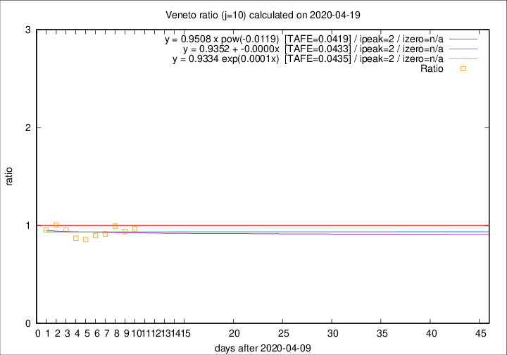

# Veneto

Data source: https://raw.githubusercontent.com/pcm-dpc/COVID-19/master/dati-json/dpc-covid19-ita-regioni.json

Delta days analysis (j): 10

Analyses for other values of j for 2020-04-19 are avalable [here](../2020-04-19/README.md)

Analyses for Veneto for previous dates are avalable [here](../README.md)

## Fitting 
|fit type|best fit equation|tafe|tfe|ipeak|izero|
|-------|-----|--------|------|---|---|
|linear|y = 0.9352 + -0.0000x  [TAFE=0.0433]|0.0433|0.0026|2|n/a|
|exp|y = 0.9334 exp(0.0001x)  [TAFE=0.0435]|0.0435|0.0013|2|n/a|
|pow|y = 0.9508 x pow(-0.0119)  [TAFE=0.0419]|0.0419|0.0012|2|n/a|

## Data
|Date|Daily deaths|Cumulated deaths|Deaths in the last 10 days|Deaths in the 10 days before|ratio|
|----|----------|-----------|-------|--------------------|-----|
|2020-04-19|28|1087|331|343|0.9650|
|2020-04-18|33|1059|323|344|0.9390|
|2020-04-17|45|1026|331|333|0.9940|
|2020-04-16|41|981|319|349|0.9140|
|2020-04-15|34|940|309|344|0.8983|
|2020-04-14|24|906|299|349|0.8567|
|2020-04-13|26|882|310|356|0.8708|
|2020-04-12|25|856|324|340|0.9529|
|2020-04-11|38|831|332|330|1.0061|
|2020-04-10|37|793|316|331|0.9547|

[Download data as CSV](COVID-19_veneto_j10_2020-04-19.csv)

Generated April 19th, 2020 at 18:42:39 UTC+0200 with https://github.com/robianc/COVID-19
