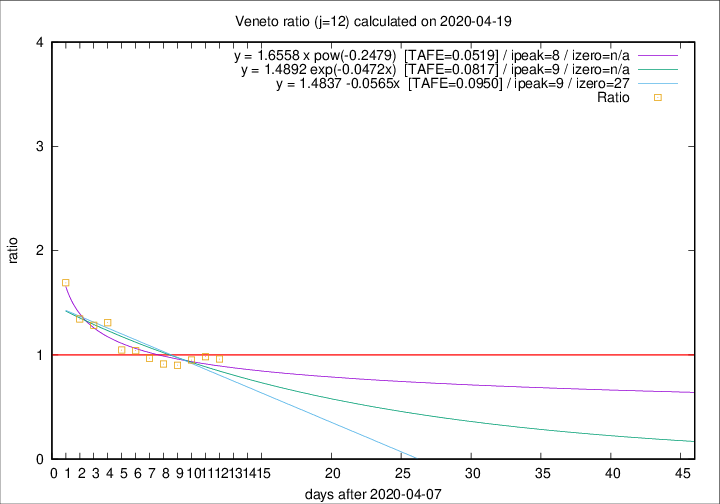

# Veneto

Data source: https://raw.githubusercontent.com/pcm-dpc/COVID-19/master/dati-json/dpc-covid19-ita-regioni.json

Delta days analysis (j): 12

Analyses for other values of j for 2020-04-19 are avalable [here](../2020-04-19/README.md)

Analyses for Veneto for previous dates are avalable [here](../README.md)

## Fitting 
|fit type|best fit equation|tafe|tfe|ipeak|izero|
|-------|-----|--------|------|---|---|
|linear|y = 1.4837 -0.0565x  [TAFE=0.0950]|0.0950|0.0091|9|27|
|exp|y = 1.4892 exp(-0.0472x)  [TAFE=0.0817]|0.0817|0.0046|9|n/a|
|pow|y = 1.6558 x pow(-0.2479)  [TAFE=0.0519]|0.0519|0.0018|8|n/a|

## Data
|Date|Daily deaths|Cumulated deaths|Deaths in the last 12 days|Deaths in the 12 days before|ratio|
|----|----------|-----------|-------|--------------------|-----|
|2020-04-19|28|1087|392|408|0.9608|
|2020-04-18|33|1059|397|404|0.9827|
|2020-04-17|45|1026|395|415|0.9518|
|2020-04-16|41|981|374|415|0.9012|
|2020-04-15|34|940|368|403|0.9132|
|2020-04-14|24|906|374|386|0.9689|
|2020-04-13|26|882|383|368|1.0408|
|2020-04-12|25|856|379|362|1.0470|
|2020-04-11|38|831|418|319|1.3103|
|2020-04-10|37|793|401|312|1.2853|
|2020-04-09|20|756|394|293|1.3447|
|2020-04-08|41|736|423|250|1.6920|

[Download data as CSV](COVID-19_veneto_j12_2020-04-19.csv)

Generated April 19th, 2020 at 18:42:39 UTC+0200 with https://github.com/robianc/COVID-19
