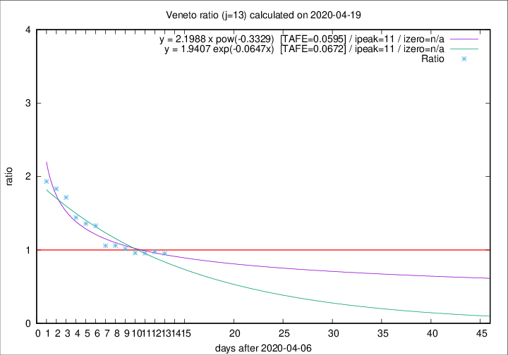

# Veneto

Data source: https://raw.githubusercontent.com/pcm-dpc/COVID-19/master/dati-json/dpc-covid19-ita-regioni.json

Delta days analysis (j): 13

Analyses for other values of j for 2020-04-19 are avalable [here](../2020-04-19/README.md)

Analyses for Veneto for previous dates are avalable [here](../README.md)

## Fitting 
|fit type|best fit equation|tafe|tfe|ipeak|izero|
|-------|-----|--------|------|---|---|
|exp|y = 1.9407 exp(-0.0647x)  [TAFE=0.0672]|0.0672|0.0028|11|n/a|
|pow|y = 2.1988 x pow(-0.3329)  [TAFE=0.0595]|0.0595|0.0023|11|n/a|

## Data
|Date|Daily deaths|Cumulated deaths|Deaths in the last 13 days|Deaths in the 13 days before|ratio|
|----|----------|-----------|-------|--------------------|-----|
|2020-04-19|28|1087|425|446|0.9529|
|2020-04-18|33|1059|428|439|0.9749|
|2020-04-17|45|1026|419|438|0.9566|
|2020-04-16|41|981|409|426|0.9601|
|2020-04-15|34|940|408|401|1.0175|
|2020-04-14|24|906|407|384|1.0599|
|2020-04-13|26|882|405|383|1.0574|
|2020-04-12|25|856|443|333|1.3303|
|2020-04-11|38|831|439|323|1.3591|
|2020-04-10|37|793|431|299|1.4415|
|2020-04-09|20|756|443|258|1.7171|
|2020-04-08|41|736|449|245|1.8327|
|2020-04-07|33|695|437|226|1.9336|

[Download data as CSV](COVID-19_veneto_j13_2020-04-19.csv)

Generated April 19th, 2020 at 18:42:39 UTC+0200 with https://github.com/robianc/COVID-19
