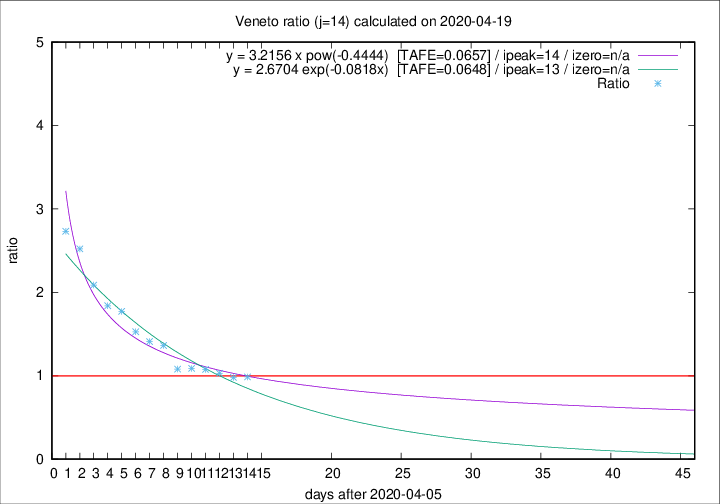

# Veneto

Data source: https://raw.githubusercontent.com/pcm-dpc/COVID-19/master/dati-json/dpc-covid19-ita-regioni.json

Delta days analysis (j): 14

Analyses for other values of j for 2020-04-19 are avalable [here](../2020-04-19/README.md)

Analyses for Veneto for previous dates are avalable [here](../README.md)

## Fitting 
|fit type|best fit equation|tafe|tfe|ipeak|izero|
|-------|-----|--------|------|---|---|
|exp|y = 2.6704 exp(-0.0818x)  [TAFE=0.0648]|0.0648|0.0038|13|n/a|
|pow|y = 3.2156 x pow(-0.4444)  [TAFE=0.0657]|0.0657|0.0029|14|n/a|

## Data
|Date|Daily deaths|Cumulated deaths|Deaths in the last 14 days|Deaths in the 14 days before|ratio|
|----|----------|-----------|-------|--------------------|-----|
|2020-04-19|28|1087|456|462|0.9870|
|2020-04-18|33|1059|452|461|0.9805|
|2020-04-17|45|1026|454|441|1.0295|
|2020-04-16|41|981|449|417|1.0767|
|2020-04-15|34|940|441|405|1.0889|
|2020-04-14|24|906|429|397|1.0806|
|2020-04-13|26|882|469|344|1.3634|
|2020-04-12|25|856|464|329|1.4103|
|2020-04-11|38|831|469|307|1.5277|
|2020-04-10|37|793|480|271|1.7712|
|2020-04-09|20|756|469|255|1.8392|
|2020-04-08|41|736|478|229|2.0873|
|2020-04-07|33|695|479|190|2.5211|
|2020-04-06|31|662|470|172|2.7326|

[Download data as CSV](COVID-19_veneto_j14_2020-04-19.csv)

Generated April 19th, 2020 at 18:42:39 UTC+0200 with https://github.com/robianc/COVID-19
