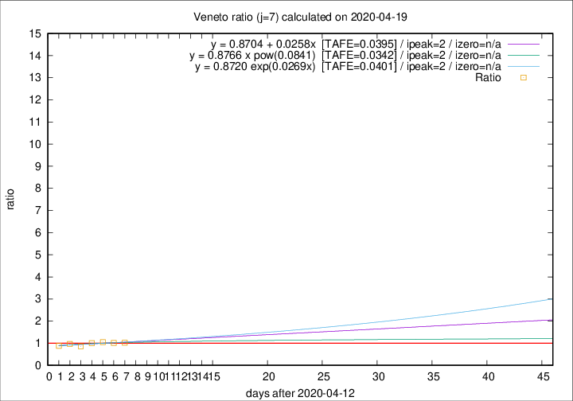

# Veneto

Data source: https://raw.githubusercontent.com/pcm-dpc/COVID-19/master/dati-json/dpc-covid19-ita-regioni.json

Delta days analysis (j): 7

Analyses for other values of j for 2020-04-19 are avalable [here](../2020-04-19/README.md)

Analyses for Veneto for previous dates are avalable [here](../README.md)

## Fitting 
|fit type|best fit equation|tafe|tfe|ipeak|izero|
|-------|-----|--------|------|---|---|
|linear|y = 0.8704 + 0.0258x  [TAFE=0.0395]|0.0395|0.0023|2|n/a|
|exp|y = 0.8720 exp(0.0269x)  [TAFE=0.0401]|0.0401|0.0011|2|n/a|
|pow|y = 0.8766 x pow(0.0841)  [TAFE=0.0342]|0.0342|0.0012|2|n/a|

## Data
|Date|Daily deaths|Cumulated deaths|Deaths in the last 7 days|Deaths in the 7 days before|ratio|
|----|----------|-----------|-------|--------------------|-----|
|2020-04-19|28|1087|231|225|1.0267|
|2020-04-18|33|1059|228|224|1.0179|
|2020-04-17|45|1026|233|221|1.0543|
|2020-04-16|41|981|225|224|1.0045|
|2020-04-15|34|940|204|237|0.8608|
|2020-04-14|24|906|211|218|0.9679|
|2020-04-13|26|882|220|249|0.8835|

[Download data as CSV](COVID-19_veneto_j7_2020-04-19.csv)

Generated April 19th, 2020 at 18:42:39 UTC+0200 with https://github.com/robianc/COVID-19
