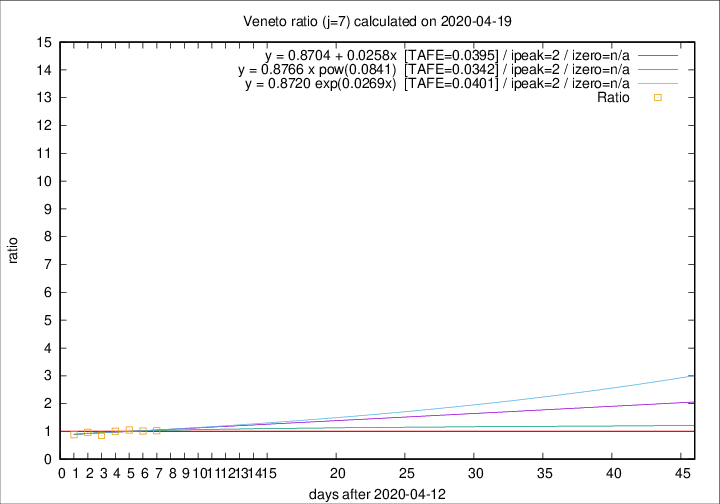

# Veneto

Data source: https://raw.githubusercontent.com/pcm-dpc/COVID-19/master/dati-json/dpc-covid19-ita-regioni.json

Estimates in this page were made on 19/4/2020 with data available until 19/04/2020.

## Summary 

### Peak estimate 
|j|linear [TAFE]|exponential [TAFE]|power law [TAFE]|details|
|---|----|-----------|---------|-------|
|7|15/4/2020 [TAFE=0.0395]|15/4/2020 [TAFE=0.0401]|15/4/2020 [TAFE=0.0342]|[analysis](COVID-19_veneto_j7_2020-04-19.md)|
|8|14/4/2020 [TAFE=0.0354]|14/4/2020 [TAFE=0.0351]|14/4/2020 [TAFE=0.0360]|[analysis](COVID-19_veneto_j8_2020-04-19.md)|
|9|13/4/2020 [TAFE=0.0449]|13/4/2020 [TAFE=0.0439]|13/4/2020 [TAFE=0.0509]|[analysis](COVID-19_veneto_j9_2020-04-19.md)|
|10|12/4/2020 [TAFE=0.0433]|12/4/2020 [TAFE=0.0435]|12/4/2020 [TAFE=0.0419]|[analysis](COVID-19_veneto_j10_2020-04-19.md)|
|11|16/4/2020 [TAFE=0.0786]|15/4/2020 [TAFE=0.0740]|14/4/2020 [TAFE=0.0545]|[analysis](COVID-19_veneto_j11_2020-04-19.md)|
|12|17/4/2020 [TAFE=0.0950]|17/4/2020 [TAFE=0.0817]|16/4/2020 [TAFE=0.0519]|[analysis](COVID-19_veneto_j12_2020-04-19.md)|
|13|18/4/2020 [TAFE=0.0913]|18/4/2020 [TAFE=0.0672]|18/4/2020 [TAFE=0.0595]|[analysis](COVID-19_veneto_j13_2020-04-19.md)|
|14|18/4/2020 [TAFE=0.1165]|19/4/2020 [TAFE=0.0648]|20/4/2020 [TAFE=0.0657]|[analysis](COVID-19_veneto_j14_2020-04-19.md)|

Best estimator is pow with j=7 (TAFE=0.0342)
Corresponding peak date estimate is 15/4/2020 (ipeak 2)

Peak date range estimate: 15/4/2020 - 27/4/2020

### End estimate 
|j|linear [TAFE/TFE]|exponential [TAFE/TFE]|power law [TAFE/TFE]|details|
|---|----|-----------|---------|-------|
|7|-|-|-|[analysis](COVID-19_veneto_j7_2020-04-19.md)|
|8|-|-|-|[analysis](COVID-19_veneto_j8_2020-04-19.md)|
|9|-|-|-|[analysis](COVID-19_veneto_j9_2020-04-19.md)|
|10|-|-|-|[analysis](COVID-19_veneto_j10_2020-04-19.md)|
|11|21/5/2020 [TAFE=0.0786]|-|-|[analysis](COVID-19_veneto_j11_2020-04-19.md)|
|12|-|-|-|[analysis](COVID-19_veneto_j12_2020-04-19.md)|
|13|-|-|-|[analysis](COVID-19_veneto_j13_2020-04-19.md)|
|14|-|-|-|[analysis](COVID-19_veneto_j14_2020-04-19.md)|

Best estimator is linear with j=11 (TAFE=0.0786)
Corresponding end date estimate is 21/5/2020 (izero 42)

End date range estimate: 9/4/2020 - 21/5/2020

Generated April 19th, 2020 at 18:42:39 UTC+0200 with https://github.com/robianc/COVID-19
